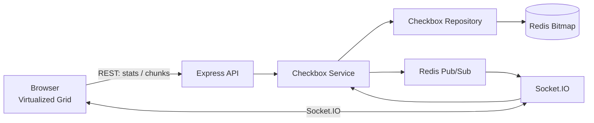

# One Million Checkboxes

## Overview

One Million Checkboxes (OMCB) is a real-time shared canvas with one million independent checkboxes. Each checkbox has a zero-based index from `0` through `999999`. Users can toggle checkboxes, view global totals, and receive updates from other connected clients.

The application models a large logical canvas without creating one million DOM nodes. Redis stores state as a bitmap, the API serves small windows of state, and the browser renders only rows near the viewport.

## Demo

The application presents a shared, virtualized checkbox canvas with live global statistics and real-time connection status.


## Video Link https://eieio.games/blog/the-secret-inside-one-million-checkboxes/

## Purpose

One Million Checkboxes was built as an engineering practice project to explore real-time and scalable web application concepts in a simple, measurable system.

The project focuses on:

- Real-time communication with Socket.IO
- Redis bitmap storage for large boolean state
- Redis Pub/Sub for cross-instance event propagation
- Patterns used for horizontal scaling
- Rate limiting and request throttling
- Atomic state updates with Lua
- Chunked data loading
- Client-side virtualization for large datasets
- Separation of transport, business logic, and persistence

The goal is not the checkbox UI itself, but understanding how these concepts work together in a system managing one million shared state values.

## Features

- One million globally shared checkbox positions
- Real-time updates through Socket.IO
- Redis bitmap storage with atomic toggle operations
- Redis Pub/Sub fan-out for multi-process or multi-instance delivery
- Chunk-based state loading with 400 checkboxes per request
- Virtualized browser rendering with a 20-column grid
- Live checked and unchecked totals
- Per-socket toggle rate limiting
- Health endpoint and Docker Compose Redis service

## Architecture



The Node.js process serves the static frontend, exposes REST routes, owns the Socket.IO server, and connects to Redis. The checkbox module is split into routes/controllers, service logic, and repository persistence operations.

## Checkbox Flow

1. The browser requests `/api/checkboxes/stats` and initializes the canvas.
2. The grid calculates the rows visible in its scroll container.
3. The browser requests only the Redis bitmap chunks needed around those rows.
4. Clicking a visible checkbox emits `checkbox:toggle` over Socket.IO.
5. The server validates the index and atomically flips the corresponding Redis bit.
6. The service reads the new global checked count and publishes an update to `omcb:checkbox:updated`.
7. Every connected Socket.IO client receives `checkbox:updated` and updates its local state and visible DOM node.

## Redis Bitmap Storage

All checkbox states are stored under the Redis key `omcb:checkboxes`:

- Bit offset = checkbox index (`0` through `999999`)
- `0` = unchecked
- `1` = checked
- `GETBIT` reads one checkbox
- `BITCOUNT` calculates the global checked count
- A Lua script performs read, invert, and `SETBIT` as one atomic operation

This uses roughly one bit per checkbox, so the bitmap itself needs about 125 KB for one million positions, excluding Redis key and data-structure overhead.

## Chunk-Based Loading

The API groups checkbox positions into chunks of 400. For chunk `n`:

```text
start = n * 400
size  = min(400, 1,000,000 - start)
```

A chunk response includes its index, starting position, size, and ordered boolean values. The browser tracks loaded chunks in a `Set`, so scrolling back over an already loaded area does not request it again during that page session.

With 1,000,000 checkboxes and 400 checkboxes per chunk, there are exactly 2,500 chunks. Chunk indexes run from `0` through `2499`. The final chunk starts at `999600` and contains indexes `999600` through `999999`.

Example: `/api/checkboxes/chunk/3` returns positions `1200` through `1599`.

## Virtualized Rendering

The logical grid has 20 columns and 50,000 rows. The browser gives the grid its full scrollable height, but creates buttons only for the visible rows plus a four-row buffer above and below the viewport.

With 32 px cells, the logical canvas is approximately 1,600,000 px tall while the DOM contains only a small viewport-sized set of buttons. Scrolling replaces the rendered window and loads the corresponding chunks on demand.

## Real-Time Synchronization

The server publishes each successful toggle to the Redis channel `omcb:checkbox:updated`. The Redis subscriber forwards that message through Socket.IO as `checkbox:updated`.

This publish/subscribe boundary means multiple Node.js instances can share the same Redis-backed state and broadcast changes received by any instance. The browser updates both the visible checkbox and global statistics when an event arrives.

## Rate Limiting

Socket toggle requests are limited to one request per 500 ms per connected socket. The limit is held in an in-memory `Map` keyed by Socket.IO connection ID and is removed when the socket disconnects.

A throttled request receives an acknowledgement such as:

```json
{
  "success": false,
  "message": "Please wait before clicking again."
}
```

This is an application-level interaction limit, not a distributed security control. REST toggle requests are not rate limited by the current implementation.

## API Endpoints

All endpoints return JSON.

| Method | Endpoint | Purpose |
| --- | --- | --- |
| `GET` | `/health` | Confirm that the service is running |
| `GET` | `/api/checkboxes/stats` | Return global checked and unchecked totals |
| `GET` | `/api/checkboxes/chunk/:chunkIndex` | Load one 400-item state chunk |
| `GET` | `/api/checkboxes/:index` | Read one checkbox state |
| `POST` | `/api/checkboxes/:index/toggle` | Atomically toggle one checkbox |

Example responses:

```json
GET /api/checkboxes/stats
{
  "checked": 12,
  "unchecked": 999988
}
```

```json
POST /api/checkboxes/42/toggle
{
  "index": 42,
  "checked": true
}
```

Valid indexes are integers from `0` through `999999`. Invalid indexes and invalid chunk indexes return HTTP `400`.

## Socket Events

### Client to server: `checkbox:toggle`

Payload: a checkbox index and a Socket.IO acknowledgement callback.

```js
socket.emit("checkbox:toggle", 42, (response) => {
  console.log(response);
});
```

Successful acknowledgement:

```json
{
  "success": true,
  "index": 42,
  "checked": true,
  "checkedCount": 13
}
```

### Server to client: `checkbox:updated`

Broadcast payload:

```json
{
  "index": 42,
  "checked": true,
  "checkedCount": 13
}
```

The browser also observes Socket.IO `connect` and `disconnect` events to show live or offline status.

## Project Structure

```text
.
├── public/
│   ├── index.html                              Static application shell
│   ├── css/styles.css                          UI styles
│   └── js/
│       ├── app.js                              Stats loading and application startup
│       ├── grid.js                             Chunk loading and virtualized rendering
│       ├── socket.js                           Socket.IO client events
│       └── state.js                            Client-side session state
├── src/
│   ├── app.js                                  Express app and static file hosting
│   ├── server.js                               HTTP, Redis, Socket.IO startup
│   ├── config/env.js                           Runtime configuration defaults
│   ├── infrastructure/
│   │   ├── redis/                              Redis client connections
│   │   └── socket/                             Socket.IO and Pub/Sub wiring
│   ├── middleware/                             Error handling middleware
│   └── modules/checkbox/
│       ├── checkbox.routes.js                  REST route definitions
│       ├── checkbox.controller.js
│       ├── checkbox.service.js                 Business flow and events
│       ├── checkbox.repository.js              Redis bitmap operations
│       └── checkbox.socket.js                  Socket event handlers and throttling
├── docker-compose.yml                          Local Redis service
├── .env.example                                Environment variable template
├── .gitignore 
├── README.md
├── package-lock.json                   
└── package.json               

```

## Installation & Setup

### Prerequisites

- Node.js 18 or newer
- npm
- Redis 6 or newer, or Docker Desktop

### Local setup

```bash
npm install
copy .env.example .env
npm run dev
```

On macOS or Linux, use `cp .env.example .env` instead of `copy`.

Open [http://localhost:3000](http://localhost:3000) in a browser.

### Start Redis with Docker

```bash
docker compose up -d redis
npm run dev
```

To stop the Redis container:

```bash
docker compose down
```

For a production-style start, use `npm start` instead of `npm run dev`.

## Configuration

The application reads these environment variables through `dotenv`:

| Variable | Default | Description |
| --- | --- | --- |
| `PORT` | `3000` | HTTP server port |
| `REDIS_URL` | `redis://localhost:6379` | Redis connection URL |

The effective checkbox count is currently fixed at `1_000_000` in `src/config/env.js`, and the chunk size is fixed at `400`. `.env.example` contains `CHECKBOX_COUNT=1000000`, but the current code does not read that variable.

## Testing

There is currently no automated test script in `package.json`. Use the following manual checks:

1. Start Redis and the application.
2. Open the main page in two browser tabs.
3. Toggle a checkbox in one tab and verify that the other tab updates immediately.
4. Scroll through the canvas and confirm that chunks load without creating one million DOM elements.
5. Open `http://localhost:3000/test-socket.html` and inspect the browser console for Socket.IO acknowledgements and update events.
6. Check service health:

```bash
curl http://localhost:3000/health
```

## Performance Strategy

- Store dense boolean state as a Redis bitmap instead of one Redis key per checkbox.
- Use an atomic Lua toggle to avoid lost updates during concurrent clicks.
- Compute counts with Redis `BITCOUNT` rather than scanning one million records in application memory.
- Fetch state in 400-item chunks instead of transferring the full bitmap to every browser.
- Cache loaded chunk indexes in the client for the current session.
- Virtualize the grid so the DOM contains only nearby rows.
- Broadcast changes through Pub/Sub so application instances do not need direct awareness of each other.
- Keep the client-side update path targeted to the changed visible checkbox.

## Concepts Utilized

- **Bitmap indexing:** map a large set of boolean flags to bit offsets for compact storage.
- **Atomicity:** use a Lua script so toggle read-modify-write behavior is indivisible.
- **Layered architecture:** keep transport handlers, business logic, and persistence operations separated.
- **Repository pattern:** isolate Redis commands in `checkbox.repository.js`.
- **Pub/Sub fan-out:** distribute state changes between server processes and connected clients.
- **Virtualization:** represent a large logical surface while materializing only the visible part.
- **Chunking:** trade a small number of predictable requests for lower initial payload and memory use.
- **Rate limiting:** throttle rapid socket actions at the connection boundary.
- **Real-time synchronization:** broadcast state changes so connected clients converge on the same checkbox state.
